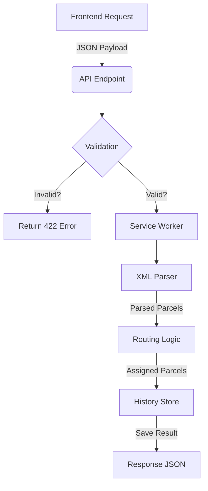

# 🐍 Tetrifox Backend Breakdown (Cheat Sheet)

## 🔄 The Main Flow: Input to Output

When you click **"Submit"** on the Frontend, here is exactly what happens on the Backend, step-by-step.



---

## 📨 1. The Input (What defines the rules?)
This is the **JSON Data** the frontend sends to `POST /api/v1/logistics/process`.

| Field | Type | Description |
| :--- | :--- | :--- |
| **`xml_data`** | `string` | The raw XML file content. |
| **`departments`** | `List` | The rules you created (e.g., Weight 0-10kg). |
| **`priority_order`** | `List[str]` | Which rule to check first (e.g., `["weight", "city"]`). |

### Example Request Payload
```json
{
  "xml_data": "<Container><Parcel>...</Parcel></Container>",
  "departments": [
    {
      "name": "Heavy Goods",
      "field": "weight",
      "type": "range",
      "min": 10,
      "max": 50
    },
    {
      "name": "Berlin Express",
      "field": "city",
      "type": "match",
      "match_value": "Berlin"
    }
  ],
  "priority_order": ["weight", "city"]
}
```

---

## ⚙️ 2. The Engine (How does it think?)

### Step A: The Parser (`XmlParserService`)
*   **Job**: Read the messy XML string and turn it into clean Python objects.
*   **Super Power**: It automatically handles typos!
    *   Finds `Recipient`, `Receipient`, or `recipient`.
    *   Finds `Address` even if it's nested deep inside.
*   **Result**: A list of `Parcel` objects. (Duplicates are removed automatically).

### Step B: The Router (`LogisticsService`)
*   **Job**: Look at each parcel and decide where it goes.
*   **Logic**: It follows your **Priority Order**.
    1.  If `Weight` is priority #1, check "Heavy Goods" rule first.
    2.  If matches -> Assign "Heavy Goods".
    3.  If no match -> Check next priority (e.g., "Berlin Express").
    4.  If nothing matches -> Return empty route `[]`.

---

## 📤 3. The Output (What do we get back?)
This is the **JSON Data** the backend sends back to display the table.

| Field | Type | Description |
| :--- | :--- | :--- |
| **`status`** | `string` | Always "success" (if no error). |
| **`total_processed`** | `int` | How many parcels were in the file. |
| **`data`** | `List` | The final list of parcels with their routes. |

### Example Response Payload
```json
{
  "status": "success",
  "total_processed": 5,
  "data": [
    {
      "parcel_id": "P001",
      "recipient": "John Doe",
      "weight": 15.5,
      "value": 100.0,
      "assigned_route": ["Heavy Goods", "Berlin Express"]
    }
  ],
  "parsing_stats": {
    "valid_parcels": 5,
    "skipped_invalid": 0
  }
}
```

---

## 🧠 Key Logic Files (Where is the code?)

| Feature | Code File | Description |
| :--- | :--- | :--- |
| **Endpoints** | `api/routes.py` | The entry door (FastAPI routes). |
| **Logic** | `services/logistics/compute.py` | The brain (Matching rules). |
| **Parsing** | `services/logistics/parser.py` | The translator (XML to Python). |
| **Validation** | `validators/logic.py` | The police (Checks min/max rules). |
| **Data Models** | `dtos/*.py` | The blueprints (Pydantic models). |
