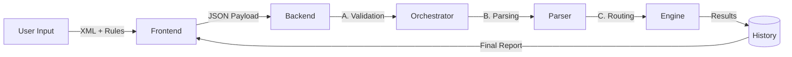

# 🦊 Tetrifox Logistics Engine

**Tetrifox** is a full-stack automated routing system designed to process messy parcel data and assign it to specific departments based on strict business rules.

## 🎨Frontend Overview

The Tetrifox Dashboard is a reactive React application that serves as the command center for the logistics engine. It allows users to visually configure complex routing logic, manage departments, and monitor parcel processing.

Above image is the frontend interface in light mode.

Above image is the frontend interface in dark mode.

Above image is the frontend interface of load processing button in dark mode.

## 🔄 System Overview (How it Works)

The application functions as a pipeline: **Raw Input -> Rule Application -> Structured Output**.

## 🧩 Key Capabilities

### 1. Intelligent Routing
The system doesn't just match data; it makes decisions based on a **Priority Hierarchy**.
*   Users define a customized list of importance (e.g., "Check Weight First, then Value, then City").
*   A parcel can flow through multiple rules or be caught by the first match, depending on configuration.

### 2. Resilient Parsing
Input data (XML) is often imperfect. The system includes a **Fuzzy Parser** that:
*   Auto-corrects typos (e.g., "Receipient" vs "Recipient").
*   Finds data in inconsistent XML structures (nested vs direct children).

### 3. Safety & Integrity
Strict constraints ensure the system never processes invalid states:
*   **No Overlaps**: Two departments cannot claim the same weight range.
*   **Bounded Ranges**: Weight and Value rules are mathematically constrained to prevent "infinite" catch-alls.

## 📂 Repository Structure

*   **/backend**: The decision engine (Python/FastAPI). Contains the routing algorithms, parsers, and validation logic.
*   **/frontend**: The control dashboard (React/TypeScript). Manages state, visualizes results, and enforces UI-level constraints.

frontend folder: python -m uvicorn main:app --reload --host 0.0.0.0 --port 8000 

backend folder: npm run dev